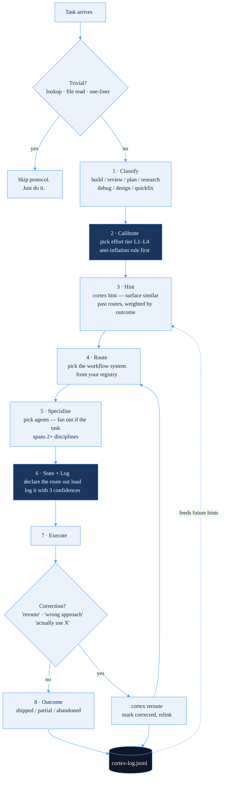
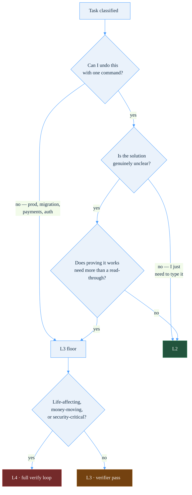
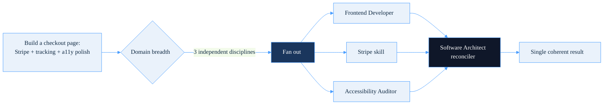
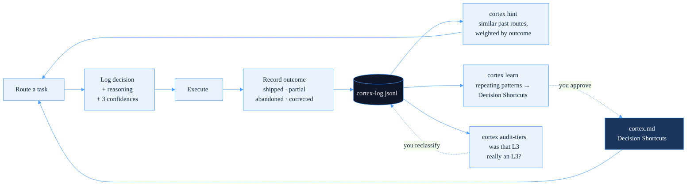

<div align="center">


# Cortex

**A meta-router for Claude Code.** It sits above every workflow system in your stack and decides — per task — which system runs, which specialist drives, and how much effort the work deserves. Then it logs the decision and learns from the outcome.


[](https://claude.com/claude-code)
&nbsp;
&nbsp;
&nbsp;

</div>

```
                                  [ Task arrives ]
                                         │
                            ┌────────────▼────────────┐
                            │    Routing Protocol     │
                            │  classify → calibrate   │
                            │  → hint → route         │
                            │  → specialise → log     │
                            │  → execute → outcome    │
                            └────────────┬────────────┘
                                         │
        ┌───────────────┬────────────────┼────────────────┬───────────────┐
        ▼               ▼                ▼                ▼               ▼
  Orchestrators    Specialists     Domain Models     Quality Gates   Infrastructure
  OMC · GSD · ECC   280+ agents    Kronos · QuantMind  CCG · Gitleaks  MCPs · Graphify
```

Cortex does not replace your workflow systems. It picks between them, attaches the right specialist, declares its reasoning out loud, and gets better at it over time.

---

## Table of contents

- [Why this exists](#why-this-exists)
- [Install](#install)
- [Using Cortex with other agents](#using-cortex-with-other-agents)
- [How it works](#how-it-works)
  - [The routing protocol](#the-routing-protocol)
  - [The tier system](#the-tier-system-l1l4)
  - [The anti-inflation rule](#the-anti-inflation-rule)
  - [Shape vs depth: when to fan out](#shape-vs-depth-when-to-fan-out)
  - [Three confidences](#three-confidences)
  - [CCG: the council, as one tool](#ccg-the-council-as-one-tool)
- [The self-learning loop](#the-self-learning-loop)
- [CLI reference](#cli-reference)
- [Slash commands](#slash-commands)
- [The stack Cortex routes between](#the-stack-cortex-routes-between)
- [Building your own registry](#building-your-own-registry)
- [Optional: SessionStart hook](#optional-sessionstart-hook)
- [Repo layout](#repo-layout)
- [Credits](#credits)

---

## Why this exists

Multi-LLM voting — [Karpathy's LLM Council](https://github.com/karpathy/llm-council), OpenRouter consensus, and friends — is a clean primitive. Several models answer, they cross-review, a chairman synthesizes. It works.

But after running my own version of it daily for months, I came to think it is **one tool, not the system.**

Routing is the harder problem. When a task lands, *"which LLMs should debate this?"* is rarely the first question worth asking. The first questions are:

- What **kind** of work is this? Build, review, plan, research, debug, design?
- What **effort tier** does it actually deserve? A one-line fix and a payments migration should not get the same machinery.
- Which **workflow system** owns this shape? A multi-agent orchestrator, a phase-based project manager, a PR pipeline, a knowledge graph?
- Which **specialist** should drive? A Backend Architect is not a Security Engineer is not a Voice AI Engineer.
- Should this **fan out** to parallel specialists with a reconciler, because it spans more than one discipline?
- And only then: does this deserve a **multi-model council** at all? Most tasks do not.

Cortex answers all of those before any model touches the work. The council becomes one possible answer rather than the whole architecture.

The second thing it does is remember. Every route is logged with its reasoning and, when the task ends, its outcome. That log is the substrate: it surfaces your repeating patterns, it biases future routes toward what actually shipped, and it lets you audit whether you have been quietly over-spending effort on work that never needed it.

---

## Install

Requires [Claude Code](https://claude.com/claude-code) with a `~/.claude/` directory. Python 3 for the CLI. Tested on macOS and Linux.

Using a different agent — Cursor, Codex, Gemini CLI, Aider, Windsurf? Cortex works there too; see [Using Cortex with other agents](#using-cortex-with-other-agents).

```bash
git clone https://github.com/amitvijapur/cortex.git
cd cortex
./install.sh
```

Then load it in every session by adding it to your global instructions:

```bash
echo '@cortex.md' >> ~/.claude/CLAUDE.md
```

Verify:

```bash
python3 ~/.claude/bin/cortex doctor
python3 ~/.claude/bin/cortex --help
```

The installer copies:

| From | To | What it is |
|---|---|---|
| `bin/cortex` | `~/.claude/bin/cortex` | The routing log, learning, and audit CLI |
| `skills/cortex-log`, `cortex-learn`, `cortex-reroute` | `~/.claude/skills/` | Slash commands inside Claude Code |
| `templates/cortex.md` | `~/.claude/cortex.md` | The framework itself — only if you don't already have one |

It does **not** touch `~/.claude/settings.json`. The SessionStart hook is opt-in; see [below](#optional-sessionstart-hook).

---

## Using Cortex with other agents

Cortex is built for Claude Code, but nothing about it is Claude-specific underneath. The framework is a single Markdown file (`cortex.md`) and the CLI is plain Python that reads and writes a state directory. Any coding agent that loads a Markdown instructions or rules file can run the same protocol.

**1. Point the CLI at a neutral state directory (optional).** By default the CLI keeps its log and state in `~/.claude/`. Set `CORTEX_HOME` to put it anywhere:

```bash
export CORTEX_HOME="$HOME/.cortex"   # add to your shell profile
python3 bin/cortex doctor            # now reads and writes ~/.cortex
```

If `CORTEX_HOME` is unset it falls back to `~/.claude`, so existing Claude Code installs are unchanged. `CLAUDE_DIR` is still honoured for backward compatibility.

**2. Load `cortex.md` into your agent's instructions file.** Each tool reads its own:

| Agent | Where the framework goes |
|---|---|
| **Claude Code** | `~/.claude/cortex.md`, referenced from `CLAUDE.md` with `@cortex.md` |
| **Codex CLI** (or any `AGENTS.md` tool) | paste `cortex.md` into `AGENTS.md` — repo root, or `~/.codex/AGENTS.md` for global |
| **Cursor** | save as `.cursor/rules/cortex.mdc`, or add it to User Rules in Settings |
| **Gemini CLI** | add the contents to `GEMINI.md` |
| **Windsurf** | save as `.windsurf/rules/cortex.md` (or legacy `.windsurfrules`) |
| **Aider** | point `read:` in `.aider.conf.yml` at `cortex.md`, or fold it into `CONVENTIONS.md` |

The routing protocol, the effort tiers, and the self-learning loop are all tool-agnostic. Only two things are Claude Code conveniences: the **slash-command skills** (other agents call `python3 bin/cortex …` directly instead), and the example **Workflow Registry** — swap that for whatever systems your agent can actually invoke.

---

## How it works

### The routing protocol

Every non-trivial task runs through eight steps before and after execution.



The output of steps 1 through 6 is always a single declared line, printed **before** execution starts:

```
OMC > ralplan > Backend Architect @ L3
```

Fan-outs render the parallelism explicitly:

```
OMC > /team > [Frontend Developer ∥ Stripe skill ∥ Accessibility Auditor] → Software Architect reconciler @ L3
```

Declaring it up front is the whole point. A silent router cannot be corrected. If the call looks wrong, you say so, and `/cortex-reroute` marks the original as corrected — which is the highest-quality training signal the log ever gets.

L1 trivia — one-line edits, file reads, casual questions — skips all of this. There is no sense routing a lookup.

---

### The tier system (L1–L4)

Tier is a **depth** decision: how much machinery does correctness actually require here?

| Tier | Name | Model / effort | Thinking | Verification | Subagents |
|---|---|---|---|---|---|
| **L1** | Reflex | fast / cheap | none | trust it | 0 |
| **L2** | Standard | mid-tier, fast mode | think | spot-check | 0–1 |
| **L3** | Deep | frontier | think hard | verifier pass | 1–2 |
| **L4** | Max | frontier, max effort | ultrathink | full verify loop | parallel team |

**The default is L2.** Heuristics push up or down from there — blast radius, ambiguity, stakes, novelty, reversibility, and how certain you sounded when you asked.



You can always override in plain language: *"go light"* forces L1, *"be thorough"* forces L3, *"must be perfect"* or *"ultrathink"* forces L4. *"bump it"* and *"drop it"* move one tier.

---

### The anti-inflation rule

This is the rule I most needed and least wanted.

**L3 must justify itself against L2, not the other way around.** Choosing L3 because the work "feels important" or "is customer-facing" is inflation, not calibration. To pick L3 you have to name a concrete failure mode that L2 would actually produce — *"L2 would skip the verifier pass and this touches auth"* — not a vibe.

Three questions. If all three are "no", it is **L2**:

1. **Cost of being wrong** — if this ships broken, does it cost money, lose trust, or break prod?
2. **Genuine uncertainty** — is the solution actually unclear, or do I just need to type it out?
3. **Non-trivial verification** — does proving correctness take more than one read-through?

This rule exists because the data said so. The first 36 routes in my own log came out at roughly **67% L3**, and an audit showed most of that was reflexive bumping on "customer-facing" or "touches more than two files". That is real tokens spent on ceremony.

`cortex audit-tiers` exists to keep me honest about it — it lists every L3 and L4 route with its stated reasoning and its actual outcome, so you can look back and ask whether L2 would have done the job. Entries can be reclassified after the fact, and the original tier is preserved for the record.

---

### Shape vs depth: when to fan out

The mistake I kept making was treating multi-agent work as an *upgrade* — something you escalate to when a task feels serious. It isn't. **Shape and tier are orthogonal.**

- **Tier** is depth: how much rigor does this need?
- **Shape** is breadth: how many independent disciplines does this touch?

If a task spans two or more independent domains, parallel specialists plus a reconciler is the *correct* shape — at whatever tier the work actually warrants. A well-scoped L2 fan-out is a perfectly normal thing. Running a cross-domain task through a single generalist agent is a routing bug, not a saving.



For high-stakes fan-outs — anything customer-facing, money-moving, or security-critical — the reconciler is upgraded from a single agent to a full [CCG council](#ccg-the-council-as-one-tool).

---

### Three confidences

Confidence in a routing decision is not one number. Three things can be independently shaky, and each has its own remedy:

| Dimension | The question it answers | If `low` → auto-trigger |
|---|---|---|
| `--route-confidence` | Am I picking the right system and pattern? | Re-run `cortex hint` with a wider net, or cross-check with a council |
| `--tier-confidence` | Is this really L3, or would L2 have done? | Flagged for the next `cortex audit-tiers` pass |
| `--spec-confidence` | Do I actually understand what you want? | **Stop before executing.** Go interview first. |

That last one is the strongest trigger in the system. The canonical failure it catches is *high route confidence, high tier confidence, low spec confidence*: **"I know exactly which tool to use, I'm just not sure what you asked for."** That is the state in which agents confidently build the wrong thing, and the only correct response is to stop and ask.

---

### CCG: the council, as one tool

CCG is Claude + Codex + Gemini — a tri-model council. It is the LLM Council pattern, alive and well, but demoted from *the architecture* to *one tool the router can reach for*.

It fires automatically on:

- **Pre-plan check** on L3/L4 work — catch single-model blind spots before execution begins
- **Irreversible actions** — migrations, prod pushes, force-pushes, payments, auth rewrites
- **User uncertainty** — "not sure", "what do you think", "am I missing something". Your uncertainty is the strongest trigger there is.
- **High-stakes reconciliation** — it replaces the single-agent reconciler in cross-domain fan-outs
- **Security audits** — a three-model pass runs *before* the Security Engineer deep dive, not instead of it
- **Conflicting outputs** — when two prior agents disagree, let a fresh council arbitrate rather than picking a winner

It is skipped on L1/L2 routine work and anywhere the answer is obvious. Three models cost three models' worth of tokens; reserve them for decisions where cross-validation actually pays for itself.

---

## The self-learning loop

Every route is appended to `~/.claude/cortex-log.jsonl` as a byproduct of working. No ceremony, no retros.

```json
{
  "ts": "2026-07-14T09:12:04Z",
  "task": "Refactor auth middleware to use the new session store",
  "class": "build",
  "system": "OMC",
  "pattern": "ralplan",
  "agent": "Backend Architect",
  "tier": "L3",
  "tier_reason": "Touches auth; L2 would skip the verifier pass",
  "system_reason": "Needs plan + verify loop, not one-shot autopilot",
  "route_confidence": "high",
  "tier_confidence": "med",
  "spec_confidence": "high",
  "outcome": "shipped"
}
```

The loop closes on itself:



Phases activate on data thresholds, not on a calendar:

| Phase | Trigger | What it does | Status |
|---|---|---|---|
| **1 · Visibility** | day one | Every route logged with full reasoning. `/cortex-log` replays it. | Active |
| **2 · Pattern surfacing** | ~20 routes | `cortex learn` finds `(class, system, pattern)` tuples that repeat ≥3× and proposes them as Decision Shortcuts. | Active |
| **3 · Similarity bias** | ~40+ routes | `cortex hint` surfaces similar past routes, scored by outcome. Shipped adds signal; corrected and abandoned subtract. **Advisory — it informs the call, it does not make it.** | Active |
| **4 · Outcome capture** | day one | Every task ends with an outcome. Correction triggers ("reroute", "wrong approach", "actually use X") mark the last route corrected and link the replacement. | Active |

Two design rules hold the whole thing together:

**Approve, don't auto-apply.** The learning layer proposes; you dispose. Cortex never silently edits its own `cortex.md`. A router that rewrites its own rules without asking is a router you cannot trust.

**Correction beats prediction.** A negative hint score means past attempts at that route failed. That is worth more than any similarity heuristic, because it is ground truth you gave it.

---

## CLI reference

```bash
# Log a route — natural form, straight from the declared routing line
cortex log-line "OMC > ralplan > Backend Architect @ L3" "refactor auth middleware" \
  --class build \
  --tier-reason "touches auth; L2 would skip the verifier pass" \
  --system-reason "needs plan+verify, not one-shot" \
  --route-confidence high --tier-confidence med --spec-confidence high

# Log a route — named-flag form, for redirects and non-standard shapes
cortex log --task "..." --class build --system OMC --pattern ralplan \
  --agent "Backend Architect" --tier L3 --redirect-from "Direct > batched-edits @ L2"

# Phase 3 — what happened last time I did something like this?
cortex hint "refactor the session store" --class build
cortex hint "..." --min-similarity 0.05 --top 10     # widen the net

# Phase 4 — close the loop
cortex outcome shipped
cortex outcome partial --note "stopped at the migration step"
cortex reroute --to "Direct > batched-edits @ L2"    # mark last route corrected

# Review and audit
cortex show --project cortex        # last 20 routes with reasoning
cortex learn                        # detect repeating patterns, write proposals
cortex learn --check                # one terse line, silent if nothing pending
cortex audit-tiers --tier L3        # every L3: was it really an L3?
cortex audit-tiers --reclassify <task_hash> --to L2 --note "L2 would have done"
cortex doctor                       # audit setup for drift between docs, skills, and log
```

`hint`, `audit-tiers`, `learn`, `show`, and `outcome` all degrade gracefully on an empty log — a fresh install tells you there is nothing to say rather than crashing.

---

## Slash commands

Inside Claude Code:

| Command | What it does |
|---|---|
| `/cortex-log` | Show recent routes with the full reasoning trail |
| `/cortex-learn` | Detect repeating patterns, write markdown proposals for new Decision Shortcuts |
| `/cortex-learn --check` | Terse session-start check — one line if a pattern is pending, silent otherwise |
| `/cortex-reroute "new route"` | Mark the last route as corrected and record what you actually wanted |

---

## The stack Cortex routes between

Cortex is only as good as the registry underneath it. Mine is below — not because you should install all of it, but to show what a populated registry looks like and to credit the people whose work it routes between.

**Orchestrators** — the systems that actually run multi-step work.

| Tool | What it's for |
|---|---|
| [oh-my-claudecode](https://github.com/Yeachan-Heo/oh-my-claudecode) | Multi-agent orchestration. Ships `ralplan`, `autopilot`, `ralph`, `/team`, and `/ccg`. The default for non-trivial builds. |
| [GSD (gsd-core)](https://github.com/open-gsd/gsd-core) | Spec-driven, phase-based project management with context-rot prevention. Best for long multi-phase builds. |
| [claude-plugins-official](https://github.com/anthropics/claude-plugins-official) | Anthropic's official marketplace — `feature-dev`, `code-review`, `pr-review-toolkit`, `security-guidance`. |

**Quality gates** — the things that argue with your work before it ships.

| Tool | What it's for |
|---|---|
| [LLM Council](https://github.com/karpathy/llm-council) | The primitive this whole project is a response to. Multiple models answer, cross-review, a chairman synthesizes. |
| [adversarial-spec](https://github.com/zscole/adversarial-spec) | Harden a spec or API contract by debating it across models until they converge. Runs *before* you build. |
| [gitleaks](https://github.com/gitleaks/gitleaks) | Deterministic secret scanner. Regex and entropy, no LLM — a reproducible pre-commit gate that never hallucinates. |
| [defending-code harness](https://github.com/anthropics/defending-code-reference-harness) | Anthropic's security harness: `/threat-model`, `/vuln-scan`, `/triage`, `/patch`. |

**Knowledge and search** — what the router reads before it decides.

| Tool | What it's for |
|---|---|
| [Graphify](https://github.com/Graphify-Labs/graphify) | Turns code, docs, papers, and media into a queryable knowledge graph. Maps *meaning*, across content you already own. |
| [Understand Anything](https://github.com/Egonex-AI/Understand-Anything) | Code-only codebase knowledge graph with architecture tours and business-domain mapping. |
| [claude-mem](https://github.com/thedotmack/claude-mem) | Cross-session memory — captures, compresses, and re-injects context. |
| [Context7](https://github.com/upstash/context7) | Live, version-specific library docs injected into context. Stops the model guessing at an API it half-remembers. |
| [Exa](https://github.com/exa-labs/exa-mcp-server) · [Firecrawl](https://github.com/mendableai/firecrawl-mcp-server) | AI-native web search, and full-page extraction to markdown. Exa finds, Firecrawl extracts. |
| [Scrapling](https://github.com/D4Vinci/Scrapling) | Adaptive scraper with anti-bot bypass — the fallback when Firecrawl hits a wall. |
| [last30days](https://github.com/mvanhorn/last30days-skill) | Recency research across Reddit, HN, X, YouTube. The complement to deep research. |

**Specialists and skills** — who actually does the work once routed.

| Tool | What it's for |
|---|---|
| [Agency Agents](https://github.com/msitarzewski/agency-agents) | 230+ domain specialists across 18 divisions — engineering, security, design, finance, GIS, marketing, and more. The specialist pool the router fans out across, and where `Specialise` picks a driver (or several). |
| [anthropics/skills](https://github.com/anthropics/skills) | First-party document skills: `docx`, `pdf`, `pptx`, `xlsx`, plus `mcp-builder` and `skill-creator`. |
| [knowledge-work-plugins](https://github.com/anthropics/knowledge-work-plugins) | Anthropic's non-code plugins — data, legal, enterprise search, PM, marketing. |
| [financial-services](https://github.com/anthropics/financial-services) | DCF, LBO, comps, earnings analysis, pitch decks — with live Excel and PowerPoint integration. |
| [Tessl](https://tessl.io/) | Framework-specific skills — Next.js, React, Stripe, Three.js, modern Python. |
| [obsidian-skills](https://github.com/kepano/obsidian-skills) | Vault operations via the Obsidian CLI. Where build logs get written. |
| [awesome-design-md](https://github.com/VoltAgent/awesome-design-md) | 58+ real `DESIGN.md` specs (Stripe, Linear, Vercel). Drop one in a project so the UI stops looking AI-generated. |
| [Hyperframes](https://github.com/heygen-com/hyperframes) | Write HTML, render deterministic MP4. Product tours, explainers, chart-race video. |

**Domain models** — where a generic LLM is simply the wrong instrument.

| Tool | What it's for |
|---|---|
| [Kronos](https://github.com/shiyu-coder/Kronos) | Foundation model for OHLCV candlestick forecasting, trained on 45+ exchanges. Use it as a feature, never as an oracle. |
| [QuantMind](https://github.com/LLMQuant/quant-mind) | Ingests financial research at scale — arXiv, SEC filings, news — into a structured, queryable knowledge base. |

**Infrastructure** — the plumbing the layers above consume.

| Tool | What it's for |
|---|---|
| [Morph](https://www.morphllm.com/) | Fast Apply edits and semantic code search. |
| [DuckDB MCP](https://github.com/motherduckdb/mcp-server-motherduck) | In-process OLAP — SQL straight over local Parquet, CSV, and JSON. |
| [Chrome DevTools MCP](https://github.com/ChromeDevTools/chrome-devtools-mcp) | Lighthouse, a11y audits, network debugging, screenshots. Visual QA. |

> **A note on GSD.** The original `gsd-build/get-shit-done` repo was archived in June 2026. Development continues at [`open-gsd/gsd-core`](https://github.com/open-gsd/gsd-core), a community fork, which is what current plugin releases treat as upstream. That is the link above. Check it out yourself before adopting it.

---

## Building your own registry

The shipped `templates/cortex.md` is a **framework, not a config.** Its Workflow Registry is deliberately stubbed — `Your Phase-Based PM System`, `Your PR / Code Review System`, and so on — with only OMC filled in as a worked example.

You populate it with what you actually run. For each system, document:

1. **Name** and whether it's installed
2. **Strengths** — one line
3. **Best for** — one line
4. **A pattern table** — the specific commands, and *when* each is the right call

Then add it to the **Decision Shortcuts** table, which is the router's cheat sheet: task type → default route → default tier.

Adding a system later is a sentence: say *"add X to Cortex"* and it gets a registry entry. The framework expects to grow.

See [`examples/cortex.md`](examples/cortex.md) for a fully populated real-world version.

---

## Optional: SessionStart hook

For a self-audit surfaced inline at session start, add this to `~/.claude/settings.json`:

```json
{
  "hooks": {
    "SessionStart": [
      {
        "hooks": [
          {
            "type": "command",
            "command": "out=$(python3 ~/.claude/bin/cortex doctor --weekly 2>/dev/null); if [ -n \"$out\" ]; then jq -n --arg c \"$out\" '{hookSpecificOutput:{hookEventName:\"SessionStart\",additionalContext:$c}}'; fi",
            "timeout": 10
          }
        ]
      }
    ]
  }
}
```

It self-gates to fire at most once every 7 days:

- All clean → `[cortex] all green (73 routes, Phase 3)`
- Drift found → `[cortex] 5 warn, 0 fail — run cortex doctor for details`
- Inside the gate window → silent, zero noise

State lives in `~/.claude/cortex-doctor-last-run`. Delete it to force a fresh check.

---

## Repo layout

```
cortex/
├── README.md            ← you are here
├── LICENSE              ← MIT
├── install.sh           ← copies files into ~/.claude/
├── bin/
│   └── cortex           ← the CLI: log, log-line, show, hint, outcome,
│                          learn, reroute, audit-tiers, doctor
├── skills/
│   ├── cortex-log/      ← /cortex-log
│   ├── cortex-learn/    ← /cortex-learn
│   └── cortex-reroute/  ← /cortex-reroute
├── templates/
│   └── cortex.md        ← the framework, registry stubbed
│                          installed to ~/.claude/cortex.md
├── examples/
│   └── cortex.md        ← a populated registry, for reference
└── assets/
    ├── cortex-flowchart.html     ← architecture diagram
    └── cortex-vs-council.html    ← LLM Council vs Cortex, side by side
```

---

## Credits

Cortex is a router. Nearly everything valuable in the stack above was built by someone else — it just decides which of them to call. Credit to every maintainer in [that table](#the-stack-cortex-routes-between).

It exists as a friendly response to [Andrej Karpathy's LLM Council](https://github.com/karpathy/llm-council). His pattern is the primitive. This is the layer above it.

## License

MIT. Use it, fork it, build something better.
