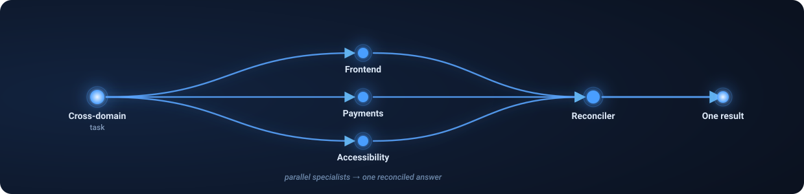

<div align="center">


# Cortex

**A meta-router for coding agents.** It sits above every workflow system in your stack and decides, per task, which system runs, which specialist drives, and how much effort the work deserves. Then it logs the decision, learns from the outcome, and ships the checks that tell you whether any of that is actually happening.

<sub>Built for **Claude Code** · runs on **Cursor, Codex, Gemini CLI, Aider & Windsurf** too — [see how ↓](#using-cortex-with-other-agents)</sub>


[](https://claude.com/claude-code)
&nbsp;
&nbsp;
&nbsp;
&nbsp;

</div>

<p align="center"></p>

Cortex does not replace your workflow systems. It picks between them, attaches the right specialist, declares its reasoning out loud, and gets better at it over time.

---

## Table of contents

- [Why this exists](#why-this-exists)
- [Install](#install)
- [What it costs you in context](#what-it-costs-you-in-context)
- [Using Cortex with other agents](#using-cortex-with-other-agents)
- [How it works](#how-it-works)
- [The self-learning loop](#the-self-learning-loop)
- [Checking the router](#checking-the-router)
- [CLI reference](#cli-reference)
- [The stack Cortex routes between](#the-stack-cortex-routes-between)
- [Building your own registry](#building-your-own-registry)
- [Repo layout](#repo-layout)
- [Credits](#credits)

---

## Why this exists

Multi-LLM voting — [Karpathy's LLM Council](https://github.com/karpathy/llm-council), OpenRouter consensus, and friends — is a clean primitive. Several models answer, they cross-review, a chairman synthesizes. It works.

After running my own version of it daily for months, I came to think it is **one tool, not the system.**

Routing is the harder problem. When a task lands, *"which LLMs should debate this?"* is rarely the first question worth asking. These are:

- What **kind** of work is this, and what **effort tier** does it actually deserve? A one-line fix and a payments migration should not get the same machinery.
- Which **workflow system** owns this shape, and which **specialist** should drive?
- Should this **fan out** to parallel specialists, because it spans more than one discipline?
- And only then: does this deserve a **council** at all? Most tasks do not.

Cortex answers those before any model touches the work, which demotes the council to one possible answer rather than the whole architecture.

Then it remembers. Every route is logged with its reasoning and its outcome, which is what lets it surface your repeating patterns, bias future routes toward what actually shipped, and show you where you have been quietly overspending effort.

---

## Install

<p align="center"></p>

Requires [Claude Code](https://claude.com/claude-code) with a `~/.claude/` directory, and Python 3. Tested on macOS and Linux. Using Cursor, Codex, Gemini CLI, Aider or Windsurf instead? [See below](#using-cortex-with-other-agents).

```bash
git clone https://github.com/amitvijapur/cortex.git
cd cortex
./install.sh
echo '@cortex.md' >> ~/.claude/CLAUDE.md   # load Cortex every session
```

Then run **`/cortex-init`**. It scans what you already run (agents, skills, MCP servers, CLIs, other-agent configs), interviews you on anything ambiguous, and writes your Workflow Registry. It never overwrites `cortex.md` without a backup and your confirmation.

Verify with `python3 ~/.claude/bin/cortex doctor`.

| The installer copies | To |
|---|---|
| `bin/cortex` | `~/.claude/bin/cortex` |
| `skills/cortex-log`, `cortex-learn`, `cortex-reroute`, `cortex-init` | `~/.claude/skills/` |
| `templates/cortex.md` | `~/.claude/cortex.md`, only if you don't already have one |

It does not touch `settings.json`.

<details>
<summary><b>Optional: a self-audit at session start</b></summary>

<br>

Add to `~/.claude/settings.json`:

```json
{
  "hooks": {
    "SessionStart": [
      {
        "hooks": [
          {
            "type": "command",
            "command": "out=$(python3 ~/.claude/bin/cortex doctor --weekly 2>/dev/null); if [ -n \"$out\" ]; then jq -n --arg c \"$out\" '{hookSpecificOutput:{hookEventName:\"SessionStart\",additionalContext:$c}}'; fi",
            "timeout": 10
          }
        ]
      }
    ]
  }
}
```

It fires at most once every 7 days: `[cortex] all green (73 routes, Phase 3)`, or `[cortex] 5 warn, 0 fail`, or silence inside the gate window. State lives in `~/.claude/cortex-doctor-last-run`; delete it to force a check.

</details>

---

## What it costs you in context

Cortex loads every session, so it is worth knowing the bill.

The shipped `templates/cortex.md` is **about 6,000 tokens** and does not grow on its own. What grows is the registry you put underneath it, and it grows faster than you notice. Mine reached 19,000 tokens before I measured it. Checking each entry against the routing log showed eight had never been reached for in 154 routes.

<p align="center"></p>

**The rule that came out of that:** split the registry by temperature, in one specific place.

- **The Decision Shortcuts table stays loaded.** It is the index. One line per task type, naming the system and when to reach for it.
- **Per-system detail loads on demand.** Pattern tables, setup notes, caveats.

Getting this backwards is the trap. Moving the shortcut rows out is not a saving, it is an amnesia bug: the router stops knowing the system exists, so it never routes there, so the entry looks unused, so you delete it.

One thing worth measuring rather than assuming. On a populated setup the framework is rarely what dominates, because a few hundred agent and skill descriptions outweigh `cortex.md` several times over. Count those first.

---

## Using Cortex with other agents

Nothing here is Claude-specific. The framework is one Markdown file and the CLI is plain Python over a state directory. Set `CORTEX_HOME` to move that state anywhere (unset, it falls back to `~/.claude`):

```bash
export CORTEX_HOME="$HOME/.cortex"
```

Then load `cortex.md` into whatever your agent reads:

| Agent | Where the framework goes |
|---|---|
| **Claude Code** | `~/.claude/cortex.md`, referenced from `CLAUDE.md` with `@cortex.md` |
| **Codex CLI** (or any `AGENTS.md` tool) | paste into `AGENTS.md`, repo root or `~/.codex/AGENTS.md` |
| **Cursor** | `.cursor/rules/cortex.mdc`, or User Rules in Settings |
| **Gemini CLI** | append to `GEMINI.md` |
| **Windsurf** | `.windsurf/rules/cortex.md` |
| **Aider** | point `read:` in `.aider.conf.yml` at it |

Only two things are Claude Code conveniences: the slash-command skills (elsewhere, call `python3 bin/cortex …` directly) and the example registry, which you should swap for systems your agent can actually invoke.

---

## How it works

### The routing protocol

<p align="center"></p>

Every non-trivial task produces a single declared line, printed **before** execution starts:

```
OMC > ralplan > Backend Architect @ L3
OMC > /team > [Frontend Developer ∥ Stripe skill ∥ Accessibility Auditor] → Software Architect reconciler @ L3
```

Declaring it up front is the whole point, because a silent router cannot be corrected. If the call looks wrong you say so, and `/cortex-reroute` records it. That correction is the highest-quality signal the log ever gets.

L1 trivia (one-line edits, file reads, lookups) skips all of this.

### The tier system

Tier is a **depth** decision: how much machinery does correctness actually require?

| Tier | Name | Model / effort | Thinking | Verification | Subagents |
|---|---|---|---|---|---|
| **L1** | Reflex | fast / cheap | none | trust it | 0 |
| **L2** | Standard | mid-tier, fast mode | think | spot-check | 0–1 |
| **L3** | Deep | frontier | think hard | verifier pass | 1–2 |
| **L4** | Max | frontier, max effort | ultrathink | full verify loop | parallel team |

<p align="center"></p>

**The default is L2.** Blast radius, ambiguity, stakes, novelty, reversibility and how certain you sounded push it up or down. Override in plain language: *"go light"* forces L1, *"be thorough"* L3, *"ultrathink"* L4, and *"bump it"* / *"drop it"* move one step.

### The anti-inflation rule

The rule I most needed and least wanted.

**L3 must justify itself against L2, not the other way around.** Picking L3 because the work "feels important" or "is customer-facing" is inflation. You have to name a concrete failure mode L2 would produce, like *"L2 would skip the verifier pass and this touches auth"*.

Three questions. All "no" means **L2**:

1. **Cost of being wrong** — does shipping this broken cost money, trust, or prod?
2. **Genuine uncertainty** — is the solution unclear, or do I just need to type it out?
3. **Non-trivial verification** — does proving correctness take more than one read-through?

This exists because the data said so. My first 36 routes came out at roughly **67% L3**, and an audit showed most of it was reflexive bumping on "customer-facing" or "touches more than two files". `cortex audit-tiers` lists every L3 and L4 with its stated reasoning and actual outcome, so you can go back and ask whether L2 would have done. Reclassifying preserves the original tier for the record.

### Shape vs depth

The mistake I kept making was treating multi-agent work as an *upgrade*, something you escalate to when a task feels serious. **Shape and tier are orthogonal.** Tier is depth; shape is how many independent disciplines a task touches.

<p align="center"></p>

Two or more independent domains means parallel specialists plus a reconciler is the *correct* shape, at whatever tier the work warrants. A well-scoped L2 fan-out is normal. Running a cross-domain task through one generalist is a routing bug, not a saving. For high-stakes fan-outs the reconciler becomes a full [council](#ccg-the-council-as-one-tool).

### Three confidences

Confidence is not one number. Three things can be independently shaky, each with its own remedy:

| Dimension | The question it answers | If `low` |
|---|---|---|
| `--route-confidence` | Am I picking the right system and pattern? | widen `cortex hint`, or cross-check with a council |
| `--tier-confidence` | Is this really L3, or would L2 have done? | flagged for the next `audit-tiers` pass |
| `--spec-confidence` | Do I actually understand what you want? | **stop before executing** and go interview |

That last one is the strongest trigger in the system. The failure it catches is *high route, high tier, low spec*: **"I know exactly which tool to use, I'm just not sure what you asked for."** That is the state in which agents confidently build the wrong thing.

### CCG: the council, as one tool

CCG is Claude + Codex + Gemini. It is the LLM Council pattern, alive and well, demoted from *the architecture* to *one tool the router can reach for*. It fires automatically on pre-plan checks at L3/L4, irreversible actions (migrations, prod pushes, payments, auth rewrites), security audits, conflicting outputs from two prior agents, and any sign of **your** uncertainty, which is the strongest trigger there is.

It is skipped on routine work. Three models cost three models' worth of tokens.

---

## The self-learning loop

Every route is appended to `~/.claude/cortex-log.jsonl` as a byproduct of working. No ceremony, no retros.

The log is **append-only**. A route writes one line; the outcome is a *second* line referencing the first by id. The original row's bytes are never touched.

```jsonc
// written when the routing line is declared
{"event": "route", "event_id": "ev_7a8d080fc1f5", "ts": "2026-07-14T09:12:04Z",
 "task": "Refactor auth middleware to use the new session store",
 "class": "build", "system": "OMC", "pattern": "ralplan",
 "agent": "Backend Architect", "tier": "L3",
 "tier_reason": "Touches auth; L2 would skip the verifier pass",
 "route_confidence": "high", "tier_confidence": "med", "spec_confidence": "high"}

// appended when the task ends — a separate line, pointing back at the route
{"event": "outcome", "event_id": "ev_3a664b902d4d", "ref": "ev_7a8d080fc1f5",
 "outcome": "shipped", "outcome_note": "landed behind a flag"}
```

<p align="center"></p>

Corrections work the same way. The current state of a route is *derived* by replaying its events, so the record of having been wrong survives being corrected, and `cortex history <event_id>` prints the chain. If a correction overwrote the original row, the log would only show what you eventually decided, never what the router first proposed. The gap between those two is the only training signal worth anything.

<p align="center"></p>

Phases activate on data thresholds, not on a calendar. All four are active:

| Phase | Trigger | What it does |
|---|---|---|
| **1 · Visibility** | day one | Every route logged with full reasoning. `/cortex-log` replays it. |
| **2 · Pattern surfacing** | ~20 routes | `cortex learn` finds `(class, system, pattern)` tuples repeating ≥3× and proposes them as shortcuts. |
| **3 · Similarity bias** | ~40+ routes | `cortex hint` surfaces similar past routes scored by outcome. **Advisory — it informs the call, it does not make it.** |
| **4 · Outcome capture** | day one | Correction triggers append an event linking the replacement, leaving the original decision on the record. |

Two rules hold it together. **Approve, don't auto-apply** — the learning layer proposes and you dispose, because a router that rewrites its own rules without asking is one you cannot trust. And **correction beats prediction** — a negative hint score means past attempts at that route failed, which is worth more than any similarity heuristic because it is ground truth you gave it.

---

## Checking the router

A router that describes its own reasoning is easy to build and easy to fool. The reasoning is generated text, so it can stay articulate while the behaviour underneath drifts. `eval/` makes the difference observable.

<p align="center"></p>

**Adherence scoring.** The protocol says to declare a tier, run `hint` before routing, and record an outcome. Whether that happens is measurable. `score_adherence.py --check` scores the log against floors in [`eval/adherence-thresholds.json`](eval/adherence-thresholds.json) and exits non-zero on a breach.

**Routing consistency.** `route_eval.py` puts a task to a headless session and asserts a property of the routing line that comes back:

| Kind | What it proves |
|---|---|
| `canary` | Only recall. The answer sits in `cortex.md` where the model can see it. Catches a protocol that stopped loading. |
| `rule` | Generalisation. A rule applied to a task the document has never seen. |
| `paired` | A directional property, comparing a transformed task against its own base rather than an absolute tier. |
| `shape` | Whether the fan-out heuristic fires at all. |

Paired cases always get their own session, because an earlier answer in a shared one anchors a later answer, which is exactly what a paired comparison must not allow. `CORTEX_HOME` is redirected to a sandbox so a model dutifully following the protocol cannot append test routes into the real log.

**Retrieval evaluation.** Agent selection is scored on a sealed train/test split, with hard negatives drawn from the same division as the target. Random negatives flatter retrieval, since telling a security agent from a marketing agent is trivial. Same-division confusion is where it actually fails.

### What this does not establish

These tests answer *"did something break?"* They do not answer *"was that a good route?"* There is no oracle for routing quality here, and building one needs labelled data that does not exist yet. A suite that quietly grew into a quality claim would be exactly the false assurance this was built to remove.

Two more limits worth stating plainly. **The floors are targets, not pre-registrations** — they were chosen with the current numbers already visible, which the thresholds file admits in its own header. They sit *below* where the system runs today, so they detect regression rather than certifying the present as good. And **a floor is not a goal**: `hint_before_route` has a floor of 25% and a target of 60%, and the floor is not an endorsement of 29%.

### What the harness has rejected

A test suite that has never contradicted its author is decoration. Two things this one killed:

- **A tuned BM25F ranker for agent retrieval.** It beat the baseline on the development set, then lost on held-out data. The corpus hygiene fixes shipped; the ranker did not.
- **A capability-confinement layer for the intake worker.** Built, then removed once the evidence showed it defended against an adversary that does not exist for a personal tool, while breaking credentials and plugin hooks. The correctness half survived: approvals are bound to a content hash, and a build reports success only when the target file actually changed, not when the model says it did.

It has also caught its own author. Changing a default ranker silently rewrote what every evaluation row was measuring, because no result recorded which ranker produced it.

---

## CLI reference

```bash
# Log a route — natural form, straight from the declared routing line
cortex log-line "OMC > ralplan > Backend Architect @ L3" "refactor auth middleware" \
  --class build --tier-reason "touches auth; L2 would skip the verifier pass" \
  --route-confidence high --tier-confidence med --spec-confidence high

# What happened last time I did something like this?
cortex hint "refactor the session store" --class build
cortex hint "..." --min-similarity 0.05 --top 10     # widen the net

# Close the loop
cortex outcome shipped
cortex outcome partial --note "stopped at the migration step"
cortex reroute --to "Direct > batched-edits @ L2"

# Review and audit
cortex show --project cortex        # last 20 routes with reasoning
cortex history <event_id>           # one route's correction chain, oldest first
cortex learn                        # detect repeating patterns, write proposals
cortex audit-tiers --tier L3        # every L3: was it really an L3?
cortex doctor                       # drift between docs, skills, and log
```

The checks live in [`eval/`](eval/) rather than the CLI:

```bash
python3 eval/score_adherence.py --check   # score the log against its floors
python3 eval/route_eval.py --dry-run      # list consistency cases, spend nothing
python3 eval/test_cortex_cli.py           # behavioural tests for the CLI
```

Everything degrades gracefully on an empty log. A fresh install says there is nothing to report rather than crashing.

**Slash commands** in Claude Code: `/cortex-log` (recent routes with reasoning), `/cortex-learn` (detect patterns, write proposals), `/cortex-learn --check` (one line, silent if nothing pending), `/cortex-reroute "new route"`.

---

## The stack Cortex routes between

Cortex is only as good as the registry underneath it. Mine is below, not because you should install all of it, but to show what a populated registry looks like and to credit the people whose work it routes between.

<details>
<summary><b>The full registry (30+ tools)</b></summary>

<br>

**Orchestrators** — the systems that actually run multi-step work.

| Tool | What it's for |
|---|---|
| [oh-my-claudecode](https://github.com/Yeachan-Heo/oh-my-claudecode) | Multi-agent orchestration. Ships `ralplan`, `autopilot`, `ralph`, `/team`, and `/ccg`. The default for non-trivial builds. |
| [GSD (gsd-core)](https://github.com/open-gsd/gsd-core) | Spec-driven, phase-based project management with context-rot prevention. Best for long multi-phase builds. |
| [claude-plugins-official](https://github.com/anthropics/claude-plugins-official) | Anthropic's official marketplace — `feature-dev`, `code-review`, `pr-review-toolkit`, `security-guidance`. |

**Quality gates** — the things that argue with your work before it ships.

| Tool | What it's for |
|---|---|
| [LLM Council](https://github.com/karpathy/llm-council) | The primitive this whole project is a response to. Multiple models answer, cross-review, a chairman synthesizes. |
| [adversarial-spec](https://github.com/zscole/adversarial-spec) | Harden a spec or API contract by debating it across models until they converge. Runs *before* you build. |
| [gitleaks](https://github.com/gitleaks/gitleaks) | Deterministic secret scanner. Regex and entropy, no LLM — a reproducible pre-commit gate that never hallucinates. |
| [defending-code harness](https://github.com/anthropics/defending-code-reference-harness) | Anthropic's security harness: `/threat-model`, `/vuln-scan`, `/triage`, `/patch`. |

**Knowledge and search** — what the router reads before it decides.

| Tool | What it's for |
|---|---|
| [Graphify](https://github.com/Graphify-Labs/graphify) | Turns code, docs, papers, and media into a queryable knowledge graph. Maps *meaning*, across content you already own. |
| [Understand Anything](https://github.com/Egonex-AI/Understand-Anything) | Code-only codebase knowledge graph with architecture tours and business-domain mapping. |
| [claude-mem](https://github.com/thedotmack/claude-mem) | Cross-session memory — captures, compresses, and re-injects context. |
| [Context7](https://github.com/upstash/context7) | Live, version-specific library docs injected into context. Stops the model guessing at an API it half-remembers. |
| [Exa](https://github.com/exa-labs/exa-mcp-server) · [Firecrawl](https://github.com/mendableai/firecrawl-mcp-server) | AI-native web search, and full-page extraction to markdown. Exa finds, Firecrawl extracts. |
| [Scrapling](https://github.com/D4Vinci/Scrapling) | Adaptive scraper with anti-bot bypass — the fallback when Firecrawl hits a wall. |
| [last30days](https://github.com/mvanhorn/last30days-skill) | Recency research across Reddit, HN, X, YouTube. The complement to deep research. |

**Specialists and skills** — who actually does the work once routed.

| Tool | What it's for |
|---|---|
| [Agency Agents](https://github.com/msitarzewski/agency-agents) | 240+ domain specialists across 20+ divisions — engineering, security, design, finance, GIS, marketing, and more. The pool the router fans out across. |
| [anthropics/skills](https://github.com/anthropics/skills) | First-party document skills: `docx`, `pdf`, `pptx`, `xlsx`, plus `mcp-builder` and `skill-creator`. |
| [knowledge-work-plugins](https://github.com/anthropics/knowledge-work-plugins) | Anthropic's non-code plugins — data, legal, enterprise search, PM, marketing. |
| [claude-tag-plugins](https://github.com/anthropics/claude-tag-plugins) | Anthropic's SaaS connector plugins — Jira, Linear, Salesforce, HubSpot, Datadog. One plugin per service. |
| [financial-services](https://github.com/anthropics/financial-services) | DCF, LBO, comps, earnings analysis, pitch decks, with live Excel and PowerPoint integration. |
| [Tessl](https://tessl.io/) | Framework-specific skills — Next.js, React, Stripe, Three.js, modern Python. |
| [obsidian-skills](https://github.com/kepano/obsidian-skills) | Vault operations via the Obsidian CLI. Where build logs get written. |
| [awesome-design-md](https://github.com/VoltAgent/awesome-design-md) | 58+ real `DESIGN.md` specs (Stripe, Linear, Vercel). Drop one in a project so the UI stops looking AI-generated. |
| [Hyperframes](https://github.com/heygen-com/hyperframes) | Write HTML, render deterministic MP4. Product tours, explainers, chart-race video. |

**Domain models** — where a generic LLM is simply the wrong instrument.

| Tool | What it's for |
|---|---|
| [Kronos](https://github.com/shiyu-coder/Kronos) | Foundation model for OHLCV candlestick forecasting, trained on 45+ exchanges. Use it as a feature, never as an oracle. |
| [QuantMind](https://github.com/LLMQuant/quant-mind) | Ingests financial research at scale — arXiv, SEC filings, news — into a structured, queryable knowledge base. |

**Infrastructure** — the plumbing the layers above consume.

| Tool | What it's for |
|---|---|
| [Morph](https://www.morphllm.com/) | Fast Apply edits and semantic code search. |
| [DuckDB MCP](https://github.com/motherduckdb/mcp-server-motherduck) | In-process OLAP — SQL straight over local Parquet, CSV, and JSON. |
| [Chrome DevTools MCP](https://github.com/ChromeDevTools/chrome-devtools-mcp) | Lighthouse, a11y audits, network debugging, screenshots. Visual QA. |
| [Toolport](https://github.com/tsouth89/toolport) | Local MCP gateway with lazy tool discovery — compact meta-tools instead of every server's full catalog. |

> **A note on GSD.** The original `gsd-build/get-shit-done` repo was archived in June 2026. Development continues at [`open-gsd/gsd-core`](https://github.com/open-gsd/gsd-core), a community fork, which is what current plugin releases treat as upstream. That is the link above. Check it out yourself before adopting it.

</details>

---

## Building your own registry

The shipped `templates/cortex.md` is a **framework, not a config**. Its registry is deliberately stubbed, with only OMC filled in as a worked example.

Run **`/cortex-init`** and Cortex discovers what you already run, interviews you on the ambiguous parts, and writes the registry for you. It adopts your stack rather than imposing one.

By hand, each system needs a name, one line on strengths, one line on what it's best for, and a pattern table saying *when* each command is the right call. Then add a row to **Decision Shortcuts**, the router's cheat sheet: task type → default route → default tier.

Adding a system later is a sentence. Say *"add X to Cortex"* and it gets an entry. See [`examples/cortex.md`](examples/cortex.md) for a populated version.

---

## Repo layout

```
cortex/
├── bin/cortex           ← the CLI: log, log-line, show, history, hint,
│                          outcome, learn, reroute, audit-tiers, doctor, init
├── eval/                ← the checks: adherence scoring, routing-consistency
│   │                      replay, retrieval evaluation, CLI tests
│   ├── README.md        ← what each one does and does not establish
│   └── adherence-thresholds.json
├── skills/              ← /cortex-log, /cortex-learn, /cortex-reroute, /cortex-init
├── templates/cortex.md  ← the framework, registry stubbed
├── examples/cortex.md   ← a populated registry, for reference
├── assets/              ← diagrams
└── install.sh
```

---

## Credits

Cortex is a router. Nearly everything valuable in the stack above was built by someone else; it just decides which of them to call. Credit to every maintainer in [that table](#the-stack-cortex-routes-between).

It exists as a friendly response to [Andrej Karpathy's LLM Council](https://github.com/karpathy/llm-council). His pattern is the primitive. This is the layer above it.

## License

MIT. Use it, fork it, build something better.
